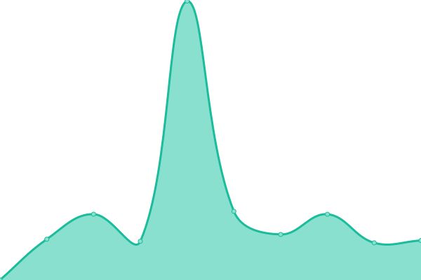

# [📈 Live Status](https://status.rubenfixit.com): <!--live status--> **🟧 Partial outage**

This repository contains the open-source uptime monitor and status page for [Ruben](https://rubenfixit.com), powered by [Upptime](https://github.com/upptime/upptime).

With [Upptime](https://upptime.js.org), you can get your own unlimited and free uptime monitor and status page, powered entirely by a GitHub repository. We use [Issues](https://github.com/RubenFixit/upptime/issues) as incident reports, [Actions](https://github.com/RubenFixit/upptime/actions) as uptime monitors, and [Pages](https://status.rubenfixit.com) for the status page.

<!--start: status pages-->
<!-- This summary is generated by Upptime (https://github.com/upptime/upptime) -->
<!-- Do not edit this manually, your changes will be overwritten -->
<!-- prettier-ignore -->
| URL | Status | History | Response Time | Uptime |
| --- | ------ | ------- | ------------- | ------ |
|  [Website (rubenfixit.com)](https://rubenfixit.com) | 🟥 Down | [website-rubenfixit-com.yml](https://github.com/RubenFixit/upptime/commits/HEAD/history/website-rubenfixit-com.yml) | 

 2624ms
     
 | 

<a href="https://status.rubenfixit.com/history/website-rubenfixit-com">92.93%</a>
    

|  [URL Shortner (rfix.me)](https://rfix.me/test) | 🟩 Up | [url-shortner-rfix-me.yml](https://github.com/RubenFixit/upptime/commits/HEAD/history/url-shortner-rfix-me.yml) | 

 854ms
     
 | 

<a href="https://status.rubenfixit.com/history/url-shortner-rfix-me">97.29%</a>
    

|  Plex Server | 🟩 Up | [plex-server.yml](https://github.com/RubenFixit/upptime/commits/HEAD/history/plex-server.yml) | 

 848ms
     
 | 

<a href="https://status.rubenfixit.com/history/plex-server">93.11%</a>
    

<!--end: status pages-->

[**Visit our status website →**](https://status.rubenfixit.com)

## 📄 License

- Powered by: [Upptime](https://github.com/upptime/upptime)
- Code: [MIT](./LICENSE) © [Ruben](https://rubenfixit.com)
- Data in the `./history` directory: [Open Database License](https://opendatacommons.org/licenses/odbl/1-0/)
